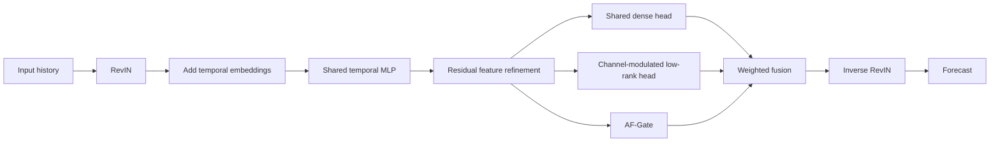

<div align="center">

# GateLinear

### Learning When to Share: Adaptive Channel–Horizon Sharing for Long-Term Time-Series Forecasting

**Shared temporal structure. Channel-specific adaptation. Input-dependent fusion.**

[Paper](paper/GateLinear.pdf) · [Model](models/GateLinear.py) · [Quick Start](#quick-start) · [Results](#main-results) · [Reproducibility](#reproducibility-status)

</div>

## Overview

GateLinear is a lightweight framework for multivariate long-term time-series forecasting. It learns **when to share** a common predictor and when to use channel-specific adaptation. A shared MLP extracts temporal features; a dense shared head and a channel-modulated low-rank head produce complementary forecasts. The aware feature gate (**AF-Gate**) combines them with sample-dependent weights for every channel and forecast step.

- **Adaptive sharing:** an input-conditioned channel–horizon mask balances the two prediction branches.
- **Compact specialization:** shared low-rank factors are modulated by channel-specific coefficients and biases.
- **Broad evaluation:** the manuscript reports results on 13 benchmarks with horizons of 96, 192, 336, and 720.

This release contains the supplied research source and manuscript. Full experiment reproduction is not yet available: the supplied snapshot omits the `run.py` entry point used by its shell scripts. See [reproducibility status](#reproducibility-status) for implementation differences and verification limits. No conference acceptance or publication status is claimed here.

## Architecture



For features $`Z\in\mathbb{R}^{N\times E}`$, the two heads produce

```math
\begin{aligned}
Y_{\mathrm{shared}} &= ZW_{\mathrm{shared}} + b_{\mathrm{shared}}, \\
Y_{\mathrm{individual}} &= ((ZW_1)\odot S)W_2 + B.
\end{aligned}
```

Here $`N`$ is the number of channels, $`E`$ the feature width, $`P`$ the forecast horizon, and $`K`$ the adaptation rank. The individual head shares $`W_1\in\mathbb{R}^{E\times K}`$ and $`W_2\in\mathbb{R}^{K\times P}`$, with channel-specific coefficients $`S\in\mathbb{R}^{N\times K}`$ and biases $`B\in\mathbb{R}^{N\times P}`$.

AF-Gate pools the features across channels and predicts channel and horizon factors for each of its $`M`$ heads:

```math
G=\sum_{m=1}^{M}\pi_m\,g_{c,m}g_{p,m}^{\top},\qquad
\pi=\operatorname{softmax}(\rho).
```

Sigmoid factors and normalized head weights give $`G\in[0,1]^{N\times P}`$. The normalized forecast is

```math
\widehat{Y}=G\odot Y_{\mathrm{shared}}+(1-G)\odot Y_{\mathrm{individual}}.
```

Inverse RevIN restores the input scale. The individual head uses $`EK+KP+NK+NP`$ parameters, compared with $`N(EP+P)`$ for independent dense heads. This saving concerns the individual head, not the entire model.

## Quick Start

### Installation

```bash
git clone https://github.com/chaserd/GateLinear.git
cd GateLinear
python -m venv .venv
# Linux/macOS:
source .venv/bin/activate
# Windows PowerShell: .venv\Scripts\Activate.ps1
python -m pip install -r requirements.txt
```

The dependency file covers the standalone GateLinear model. Dependencies are unpinned because the supplied snapshot does not contain a validated environment lockfile. The legacy experiment framework imports additional baseline packages; this installation is not a verified environment for every baseline.

### Model inference

Run this Python example from the repository root. It uses synthetic inputs and randomly initialized parameters; it demonstrates the interface, not forecasting accuracy.

```python
from types import SimpleNamespace
import torch
from models.GateLinear import Model

config = SimpleNamespace(
    seq_len=96,
    pred_len=96,
    enc_in=21,
    d_model=512,
    use_norm=1,
    freq="h",
)
torch.manual_seed(2027)
model = Model(config).eval()
x = torch.randn(2, config.seq_len, config.enc_in)

# Calendar columns: month, day, weekday, hour.
# The hourly GateLinear embedding reads the hour column.
marks = torch.zeros(2, config.seq_len, 4)
marks[:, :, 3] = torch.arange(config.seq_len).remainder(24)

with torch.no_grad():
    forecast = model(x, marks)
print(forecast.shape)  # torch.Size([2, 96, 21])
```

Inputs have shape `[batch, lookback, channels]`; outputs have shape `[batch, horizon, channels]`. For `freq="t"`, provide a fifth calendar column containing quarter-hour indices in `0..3`. `x_mark_enc=None` skips temporal embeddings. Decoder inputs are accepted by the model interface but are unused.

### Model configuration

| Setting | Default / paper value | Meaning |
|:--|:--|:--|
| `seq_len` | 96 in the paper | Historical input length |
| `pred_len` | 96 / 192 / 336 / 720 | Forecast horizon |
| `enc_in` | Dataset-dependent | Number of input channels |
| `d_model` | 512 in the paper | Feature width $`E`$ |
| Backbone hidden width | 128, fixed in `Backbone` | Intermediate MLP width $`D`$ |
| `low_rank_k` | `int(0.3 * E * P / (E + P))` | Optional rank override |
| Gate hidden width | 16, fixed by `Model` | Gate bottleneck $`R`$ |
| Gate heads | 8 | Number of channel–horizon outer products |
| Gate dropout | 0.1 | Dropout inside AF-Gate |
| `use_norm` | Required config field; use `1` | Enable RevIN |

With $`E=512`$, the default ranks are 24, 41, 60, and 89 for the four paper horizons. The code does not clamp the default rank to at least one; use a positive `low_rank_k` for very small custom configurations.

The model also accepts `use_temporal_emb`, `use_attention`, `use_gate`, `use_shared_branch`, and `use_individual_branch`; these default to `True`. At least one prediction branch must remain enabled. These are configuration attributes, not verified command-line flags.

## Main Results

**Paper-reported results**, transcribed from Table 1 of the supplied manuscript. Values are averaged over $`P\in\{96,192,336,720\}`$ with lookback $`L=96`$. Lower MSE and MAE are better. These numbers were not regenerated during repository preparation.

| Dataset | GateLinear MSE | GateLinear MAE | XLinear MSE | XLinear MAE |
|:--|--:|--:|--:|--:|
| Weather | **0.243** | **0.271** | 0.251 | 0.275 |
| Electricity | 0.177 | 0.271 | **0.174** | **0.268** |
| Traffic | **0.482** | **0.311** | 0.504 | 0.330 |
| Solar | **0.236** | **0.268** | 0.256 | 0.276 |
| ETTh1 | 0.453 | 0.439 | **0.448** | **0.435** |
| ETTh2 | 0.385 | 0.407 | **0.378** | **0.401** |
| ETTm1 | 0.397 | 0.399 | **0.395** | **0.397** |
| ETTm2 | 0.284 | **0.326** | **0.282** | **0.326** |
| PEMS03 | **0.281** | **0.361** | 0.334 | 0.394 |
| PEMS04 | **0.240** | **0.343** | 0.265 | 0.362 |
| PEMS07 | **0.223** | **0.318** | 0.246 | 0.336 |
| PEMS08 | **0.426** | **0.393** | 0.482 | 0.431 |
| Exchange | 0.389 | 0.418 | **0.382** | **0.415** |

Bold indicates the better value within this two-model comparison, including ties. The manuscript includes eight methods in its full table; GateLinear has the lowest reported average MSE and MAE on Weather, Traffic, Solar, and the four PEMS datasets. Results are single-seed point estimates, without uncertainty intervals.

### Parameter efficiency

Table 3 reports the following at $`L=P=96`$:

| Dataset | Model | MSE | MAE | Parameters |
|:--|:--|--:|--:|--:|
| Weather | GateLinear | 0.1595 | 0.2039 | 0.17M |
| Weather | XLinear | 0.1677 | 0.2119 | 0.16M |
| Electricity | GateLinear | 0.1454 | 0.2420 | 0.25M |
| Electricity | XLinear | 0.1455 | 0.2427 | 0.32M |
| Electricity | iTransformer | 0.1474 | 0.2393 | 4.83M |

On Electricity, the reported GateLinear parameter count is approximately 5.2% of iTransformer's; the two models trade off MSE and MAE. The manuscript's ablation table is a separate comparison and contains slightly different full-model Electricity values.

## Data and Experiment Settings

Dataset files, checkpoints, generated predictions, and training logs are excluded from this source release. Obtain datasets separately and set their paths in your experiment configuration.

The supplied data factory recognizes `ETTh1`, `ETTh2`, `ETTm1`, `ETTm2`, `custom`, `Solar`, and `PEMS`. Weather, Electricity, Traffic, and Exchange use the custom CSV loader. Inspect [data_loader.py](data_provider/data_loader.py) for the expected columns, splits, and normalization of each format.

The manuscript specifies Adam with $`(\beta_1,\beta_2)=(0.9,0.999)`$, epsilon $`10^{-8}`$, no weight decay, MSE loss, at most 30 epochs, early-stopping patience 5, and seed 2027 for Python, NumPy, and PyTorch.

| Dataset family | Learning rate | Batch size |
|:--|--:|--:|
| Weather | 0.001 | 64 |
| Electricity | 0.005 | 16 |
| ETT | 0.001 | 256 |
| PEMS | 0.003 | 32 |
| Solar | 0.003 | 64 |
| Traffic | 0.003 | 16 |
| Exchange | 0.005 | 8 |

These are paper settings, not a claim that every archived script implements them.

## Reproducibility Status

The core GateLinear architecture is present, alongside data loaders, the experiment framework, baseline implementations, and historical scripts. The source snapshot has the following known gaps:

| Item | Current source behavior | Implication |
|:--|:--|:--|
| Training entry point | Scripts call `run.py`, which is absent | Restore the matching training entry point before using the scripts |
| Random seed | The active Electricity block in `scripts/gatelinear/GateLinear.sh` uses 2026 | The paper reports seed 2027 |
| Script coverage | Most dataset blocks in that script are commented out | It is not a complete 13-dataset launcher |
| Time features | `data_factory.py` forces `timeenc=1`, producing continuous features for calendar-based loaders | GateLinear expects integer calendar indices; `.long()` truncation does not recover the hour or quarter-hour |
| Validation loader | Validation follows the training branch with shuffling and `drop_last=True` | The paper describes ordered validation with all samples retained |
| Gate ablation | With `use_gate=False` and both branches enabled, the model returns only the shared output | This does not implement the direct-addition ablation described in the paper |
| Environment | No original dependency lockfile was supplied | The minimal requirements added here are not a frozen reproduction environment |

The original Python and shell sources are preserved in this release. These observations document the snapshot; no silent changes were made to training behavior to force agreement with the paper. Repository preparation included source inspection and syntax checks, but no training or runtime inference validation: PyTorch was unavailable in the preparation environment.

## Repository Structure

```text
GateLinear/
├── models/GateLinear.py          # Backbone, two heads, AF-Gate, forecast interface
├── layers/RevIN.py               # Reversible normalization
├── layers/                      # Shared model components
├── data_provider/               # Dataset readers and data factory
├── exp/                         # Experiment framework
├── scripts/gatelinear/           # Historical GateLinear experiment script
├── scripts/                     # Additional experiment scripts
├── utils/                       # Metrics and experiment utilities
├── paper/GateLinear.pdf          # Supplied manuscript
├── requirements.txt             # Minimal standalone model dependencies
└── README.md
```

## Citation

Use the following manuscript citation until a verified proceedings or preprint record is available. No venue, year, or identifier has been inferred from the local filename.

```bibtex
@misc{gatelinear,
  title  = {Learning When to Share: Adaptive Channel--Horizon Sharing
            for Long-Term Time-Series Forecasting},
  note   = {Manuscript accompanying the GateLinear source release},
  url    = {https://github.com/chaserd/GateLinear}
}
```

## Acknowledgments

The source tree includes implementations of several forecasting baselines and shared forecasting utilities. Please credit the original methods and retain applicable upstream notices when reusing those components. The supplied snapshot has no top-level license file; this release does not assign a new license to third-party source.

For repository questions, open an issue.
